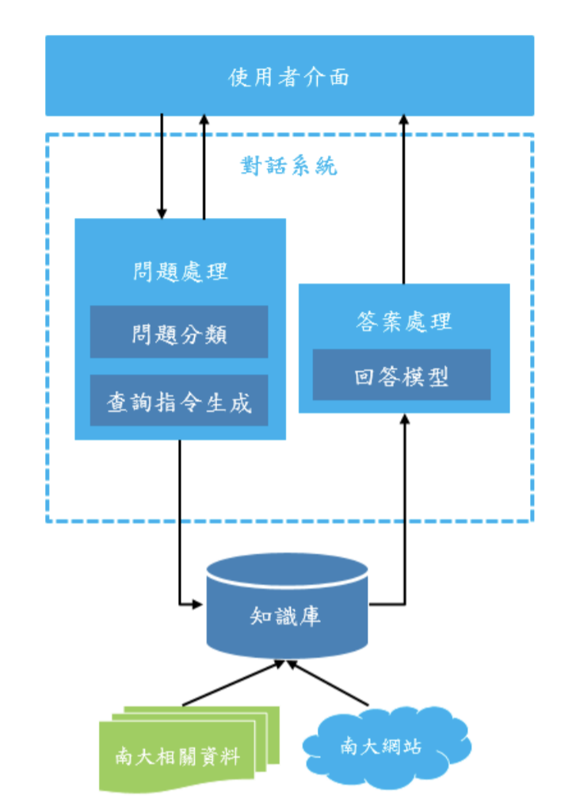
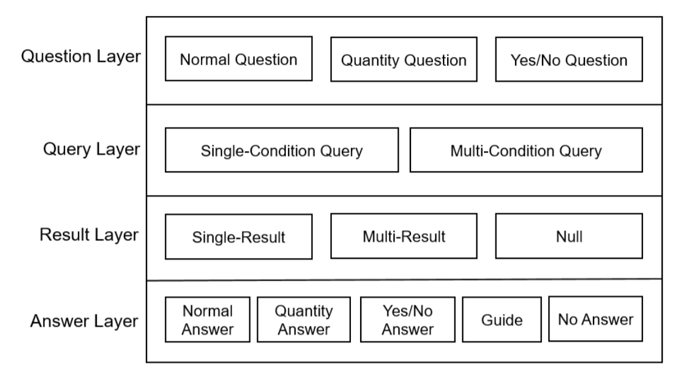
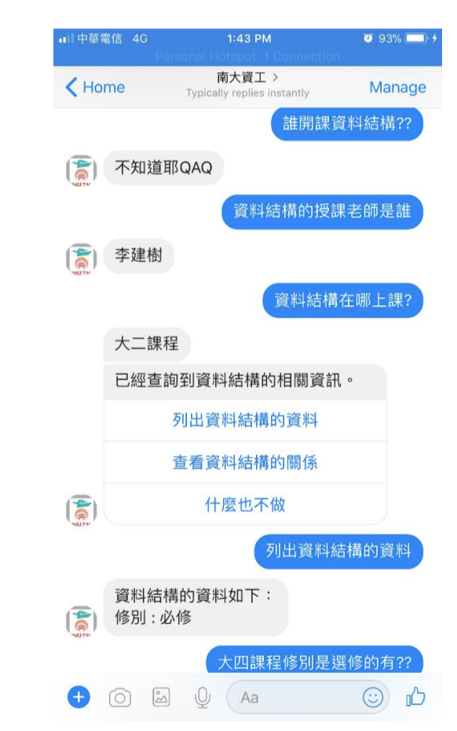
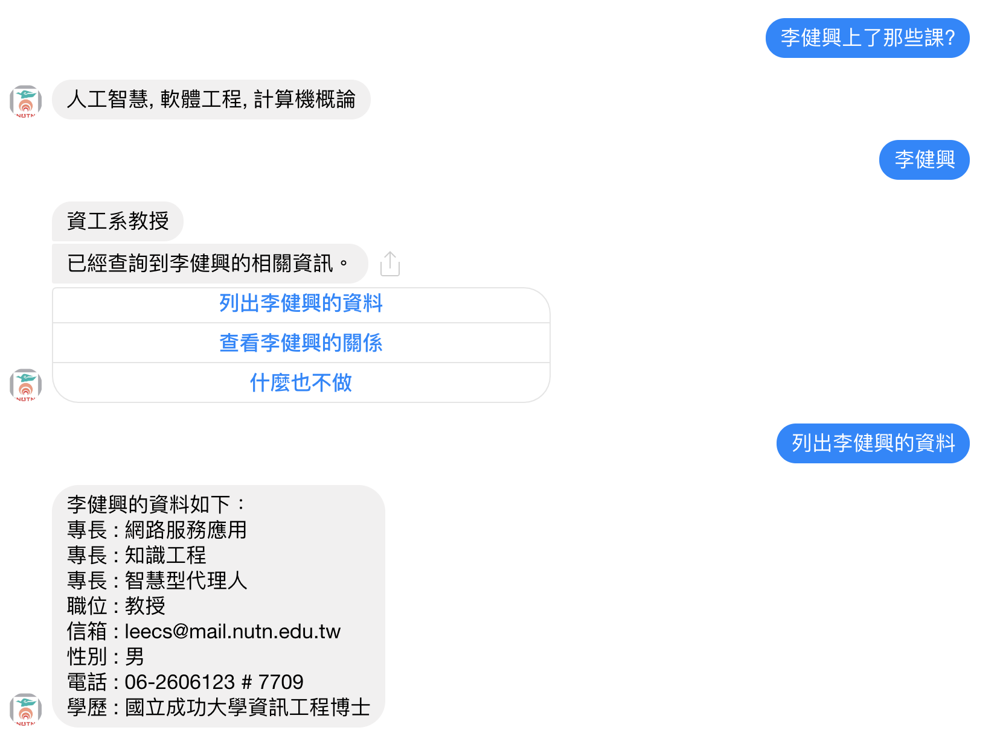

# NUTN_Chatbot

My Undergraduate final project, an **Chatbot-based Interactive Question Answering System**.

We Build a closed-domain ontology using [protégé](https://protege.stanford.edu/), implement a dialogue system to handle user's input questions, concatenate the chatbot with [Facebook Messenger API](https://developers.facebook.com/docs/messenger-platform/) (front-end) and [Heroku](https://www.heroku.com/) (back-end).

## Contributors:
- Jin-Sheng Lin
- Wen-Jie, Huang

## Awards:
- 臺南大學資訊工程學系107級專題競賽「第三名」
- 第五屆南區大專資訊專題競賽暨成果觀摩會「最佳團隊獎」

## System Architecture

## System Layers

## Demo: APP

## Demo: WebPage

